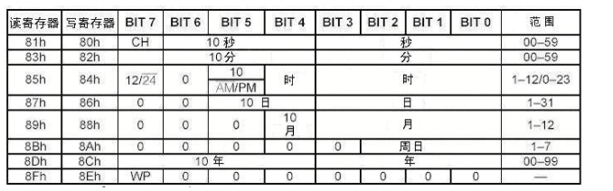
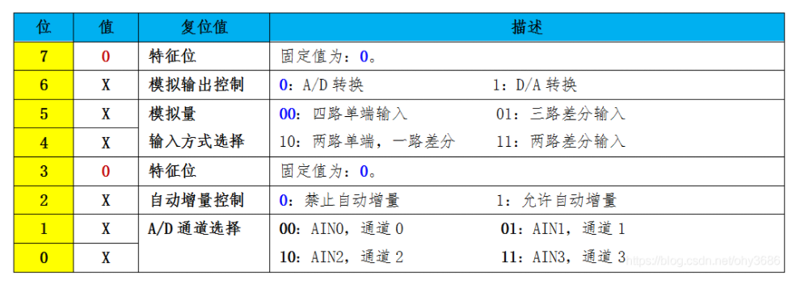

# 蓝桥杯单片机
## 模块
### M74HC573M1R锁存器 
先赋值P0，接着对P27-P25进行清零，并定位对应锁存器，进行使用。

其格式为:
```C
P0 = XX;
P2 & 0x1F | 0x80; // 其中0x80为对应锁存器地址
P2 &= 0x1F;
```
1. P27-P25 = 100(0x80) 驱动 Y4C  ——置初始化

    其对应8个LED灯
2. P27-P25 = 101(0xA0) 驱动 Y5C  ——置0初始化

    用于电机驱动模块
3. P27-P25 = 110(0xC0) 驱动 Y6C

    用于7段数码管的公共端
4. P27-P25 = 111(0xE0) 驱动 Y7C

    用于7段数码管的数据线
5. 没有用的外设记得关闭，函数如下：
    ```C
    void cls_peripheral(void)
    {
        /* 初始化LED模块 */
        P0 = 0xFF;
        P2 & 0x1F | 0x80; 
        P2 &= 0x1F;
        /* 初始化蜂鸣器 继电器模块 */
        P0 = 0;
        P2 & 0x1F | 0xA0; 
        P2 &= 0x1F;
    }
    ```
---
### 延时函数
```C
void delay_ms(unsigned int n) //延时n毫秒
{
    unsigned int i;
    while(n--)
        for(i = 0; i < 628; i ++);
}

void delay_s(unsigned int n) //延时n秒
{
    unsigned int i=0,j=0;
    for(i=0;i<n;i++)
        for(j=0;j<21738;j++);
}
```
---
### 中断程序
1. 中断初始化
```C
void system_init(void)
{
    EX0 = 1; //允许外部中断0
    IT0 = 1; //下沿触发。如果IT=0，则上下沿都触发
    EX1 = 1; //允许外部中断1
    IT1 = 1; 
    EA = 1; //开启总中断
}
```
2. 定时器初始化
   
计数值计算： 设最大计数值为M, 初值为X
* 1T模式：

    X = M - 要求的定时值/(1/系统时钟频率)
* 12T模式：

    X = M - 要求的定时值/(12/系统时钟频率)
```C
void timer_init(void)
{
    AUXR &= 0x7F; //定时器0时钟为12T模式 01111111 左1为T0x12 左2为T1x12 右3为T2x12
    TMOD &= 0xF0; //设置定时器模式（左四位为定时器1，右四位为定时器0）
    TL0 = 0x18; //设置定时初值
    TH0 = 0xFC;
    TF0 = 0; //清除TF0标志位
    TR0 = 1; //定时器0开始计时
    ET0 = 1; //允许定时器0中断
    EA = 1; //开启总中断
}
```
PS. 可以用STC-ISP自动生成

---
### 数码管程序
1. 码段对照：（低电平点亮）

    [1 1 1 1 1 1 1 1] 对应 [dp g f e d c b a]
2. 显示代码：
```C
void seg_disp(uchar *seg_code, uchar seg_pos)
{
	P0 = 0xFF;
	Select_HC573(7);         //段选
	P2 &= 0x1F;
	P0 = 1 << seg_pos;
	Select_HC573(6);         //位选
	P2 &= 0x1F;
	P0 = seg_code[seg_pos];
	Select_HC573(7);         //段选
	P2 &= 0x1F;
}
```
---
### 按键
1. 代码举例：

    按键矩阵：
    ```C
    uchar key_read(void)
    {
        uint key_new;
        uchar key_val;
        P44 = 0; P42 = 1; P35 = 1; P34 = 1;
        key_new = P3;

        P44 = 1; P42 = 0;
        key_new = (key_new << 4)|(P3 & 0x0F);
        P42 = 1; P35 = 0;
        key_new = (key_new << 4)|(P3 & 0x0F);
        P35 = 1; P34 = 0;
        key_new = (key_new << 4)|(P3 & 0x0F);

        switch(~key_new)
        {
            case 0x8000: key_val = 4; break;
            case 0x4000: key_val = 5; break;
            case 0x2000: key_val = 6; break;
            case 0x1000: key_val = 7; break;
            case 0x0800: key_val = 8; break;
            case 0x0400: key_val = 9; break;
            case 0x0200: key_val = 10; break;
            case 0x0100: key_val = 11; break;
            case 0x0080: key_val = 12; break;
            case 0x0040: key_val = 13; break;
            case 0x0020: key_val = 14; break;
            case 0x0010: key_val = 15; break;
            case 0x0008: key_val = 16; break;
            case 0x0004: key_val = 17; break;
            case 0x0002: key_val = 18; break;
            case 0x0001: key_val = 19; break;
            default: key_val = 0;
        }
        return key_val;	
    }
    ```
---
### DS1302时钟
1. 下面是DS1302时钟写入时的地址和对应作用：
    |地址|对应|地址|对应|
    |---|---|---|---|
    |0x80|秒|0x82|分|
    |0x84|时|0x86|日|
    |0x88|月|0x8A|周|
    |0x8C|年|0x8E|控制|

2. 下面是DS1302时钟读取时的地址：
    |地址|对应|地址|对应|
    |---|---|---|---|
    |0x81|秒|0x83|分|
    |0x85|时|0x87|日|
    |0x89|月|0x8B|周|
    |0x8D|年|||

其中：
* 秒寄存器的第七位为时钟开关
* 除了周寄存器，其他的都是高四位记录十位，低四位记录个位
* 时寄存器的**最高位**为1，则12小时制；为0，则24小时制
* 控制寄存器的**最高位**为0，解除写保护；为1，开启写保护
* 还拥有31字节的RAM空间，开始地址为0x94

    
3. 代码举例：
```C
	Write_Ds1302_Byte(0x84, temp); //写入时间
    temp = Read_Ds1302_Byte(0x85); //读取时间
```
---
### DS18B20温度传感器
1. 下面是有用的写入地址和对应作用:
    |地址|对应|地址|对应|
    |---|---|---|---|
    |0xBE|读暂存器|0xCC|跳过ROM|
    |0x44|转换温度|||
下面是需要添加在onewire.c下的读取温度函数
```C
uint rd_temperature(void)
{
	uchar low, high;
	init_ds18b20();
	Write_DS18B20(0xCC);
	Write_DS18B20(0x44); //	转换温度

	init_ds18b20();
	Write_DS18B20(0xCC);
	Write_DS18B20(0xBE);
	low = Read_DS18B20();
	high = Read_DS18B20();
	return (high << 8) + low;
}
```
---
### PCF8591
1. 读地址：0x91,写地址：0x90。
2. 控制寄存器：
   * 光敏传感器：AIN1,通道1；控制寄存器写入：0x01（光越强阻值越低）
   * 电位器：AIN3，通道3；控制寄存器写入：0x03
   * 第6位：0：A/D转换；1：D/A转换
    
3. A/D转换程序设计流程：
   * 发送写设备地址，选择IIC总线上面的PCF8591
   * 发送控制字节，选择模拟量输入模式和通道
   * 发送读设备地址，选择IIC总线上的PCF8591器件
   * 读取PCF8591中目标通道数据 
4. 代码举例:
* A/D
    ```C
    uchar pcf8591_Adc(void)
    {
        uchar temp;
        
        IIC_Start();
        IIC_SendByte(0x90);
        IIC_WaitAck();

        IIC_SendByte(0x43);    //通道选择
        IIC_WaitAck();

        IIC_Start();
        IIC_SendByte(0x91);
        IIC_WaitAck();

        temp = IIC_RecByte();
        IIC_SendAck(1);
        IIC_Stop();
        return temp;
    }
    ```
* D/A
    ```C
    void pcf8591_Dac(uchar dat)
    {
        IIC_Start();
        IIC_SendByte(0x90);
        IIC_WaitAck();

        IIC_SendByte(0x43);
        IIC_WaitAck();

        IIC_SendByte(dat);
        IIC_SendAck();
        IIC_Stop();	
    }
    ```